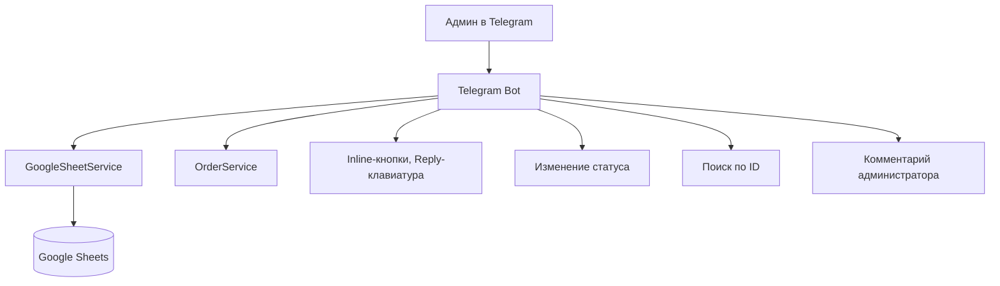
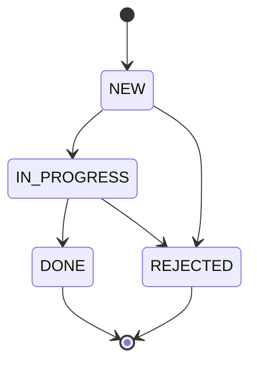
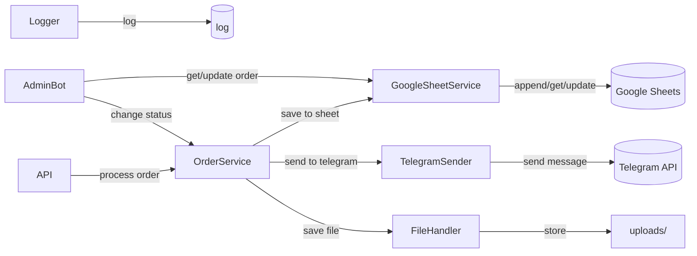
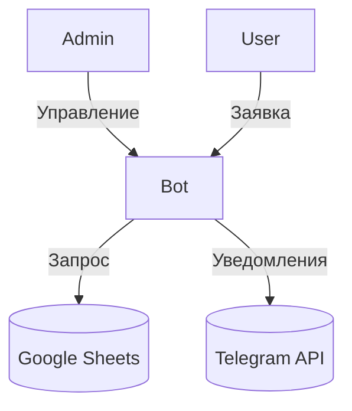

# ARCHITECTURE_DIAGRAMS.md

## 1. Общая архитектура модулей

```mermaid
graph TD
    A[main.py] --> B[api/ (FastAPI)]
    B --> C[bot/ (Telegram Bot)]
    B --> D[services/]
    D --> D1[OrderService]
    D --> D2[GoogleSheetService]
    D --> D3[TelegramSender]
    D --> D4[FileHandler]
    D --> D5[Logger]
    B --> E[config/ (get_settings)]
    B --> F[utils/]
    B --> G[files/ (uploads)]
    B --> H[tests/ (unit, integration, e2e)]
    D2 --> I[Google Sheets]
    D3 --> J[Telegram API]
    B --> K[admin-интерфейс в Telegram]
    B --> L[uploads/]
    B --> M[.env, .gitignore]
    B --> N[CI/CD, GitHub Actions]
```

---

## 2. User Flow (Заявка с сайта)

```mermaid
graph TD
    SiteForm[Форма на сайте] --> API[API (FastAPI)]
    API --> OrderService
    OrderService --> GoogleSheetService
    OrderService --> TelegramSender
    GoogleSheetService --> GoogleSheets[(Google Sheets)]
    TelegramSender --> TelegramGroup[(Telegram-группа)]
    OrderService --> FileHandler
    FileHandler --> Uploads[uploads/]
```

---

## 3. Admin Flow (Работа с заявками)



---

## 4. State Machine (Статусы заявки)



---

## 5. Взаимодействие сервисов



---

## 6. Взаимодействие с внешними сервисами



---

## 7. Взаимодействие сервисов и тестов

```mermaid
graph LR
    OrderService & GoogleSheetService & TelegramSender & FileHandler --> Tests[tests/ (unit, integration, e2e)]
    Tests --> DI[DI/mocks/singleton reset]
    Tests --> CI[CI/CD]
```

---

**Диаграммы отражают реальную архитектуру SH Studio Bot: заявки, Google Sheets, Telegram, админ-интерфейс, DI, тесты, CI/CD.** 